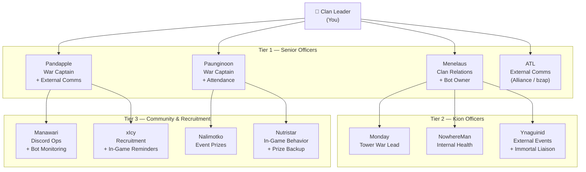
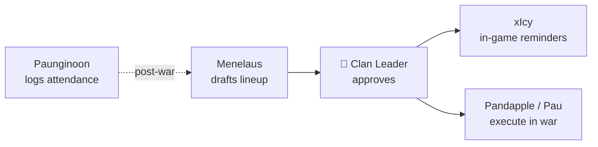
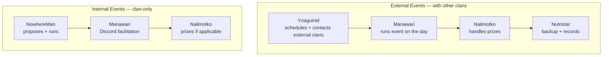

# Zeus Clan — Officer Roles & Responsibilities

> Source of truth for officer duties, reporting lines, and cross-functional workflows.
> Mermaid diagrams render automatically on GitHub.

---

## Org Chart

---

## Tier 1 — Senior Officers

### 👑 Clan Leader (You)
- [ ] Final call on Shadow War / VoB lineup
- [ ] Receives lineup from Menelaus → forwards to xIcy for in-game reminders
- [ ] Bot owner of record (delegates day-to-day to Menelaus)
- [ ] Receives bug reports from Manawari

### Menelaus — Clan Relations + Bot Owner
- [ ] Maintain alliance contact + internal affairs
- [ ] Draft Shadow War / VoB lineup → submit to Clan Leader
- [ ] **Bot ownership:** zeus-bot admin, role/channel structure, deploys
- [ ] Sync weekly with Pandapple/ATL on alliance status

### Pandapple — War Captain + External Comms (Day-to-Day)
- [ ] War captain duties (lineup execution in-game)
- [ ] Day-to-day alliance communication
- [ ] Coordinate with bzap server / external clans
- [ ] Report alliance issues up to Menelaus

### Paunginoon — War Captain + Attendance
- [ ] War captain duties (lineup execution in-game)
- [ ] Track war attendance (sole owner)
- [ ] Maintain war roster
- [ ] Escalate no-shows / repeat absences

### ATL — External Comms (Backup / Specialty)
- [ ] Backup alliance liaison (cover for Pandapple)
- [ ] Outbound coordination with non-alliance servers
- [ ] Report up to Menelaus

---

## Tier 2 — Kion Officers

### Monday — Tower War Lead
- [ ] Open tower signups
- [ ] Send tower reminders
- [ ] Maintain tower roster

### NowhereMan — Internal Health
- [ ] Monitor clan morale + engagement
- [ ] Collect member feedback
- [ ] Run **internal** activities (in-clan only)

### Ynaguinid — External Events + Immortal Liaison
- [ ] Schedule **external** events with other clans (War Games, etc.)
- [ ] Schedule events **after** regular war calendar
- [ ] Sole point of contact for Immortal activities

---

## Tier 3 — Community & Recruitment

### Manawari — Discord Ops + Bot Monitoring
- [ ] Discord moderation + activity monitoring
- [ ] Facilitate clan events (run-of-show)
- [ ] **Bot monitoring:** suggest bot features, report bugs to Clan Leader
- [ ] Cross-officer comms coordination

### xIcy — Recruitment + In-Game Reminders
- [ ] Recruitment + social media campaigns
- [ ] Shadow War in-game reminders (uses lineup from Clan Leader)

### Nalimotko — Event Prize Coordinator
- [ ] Manage event prize pool
- [ ] Record winners (event log)

### Nutristar — In-Game Behavior + Prize Backup
- [ ] Monitor in-game behavior, relationships, factions
- [ ] Backup Nalimotko on prize coordination

---

## Workflow: Shadow War / VoB Lineup

---

## Events Pipeline — External vs Internal

External and internal events have **separate owners** to avoid overlap.

| Aspect | External Events | Internal Events |
|---|---|---|
| Owner | Ynaguinid | NowhereMan |
| Scheduling | After regular war calendar | Anytime, around clan health |
| Outside contact | Yes (other clans) | No |
| Discord facilitation | Manawari | Manawari |
| Prizes | Nalimotko (Nutristar backup) | Nalimotko (if applicable) |

---

## Member Monitoring — Split by Domain

To avoid four officers stepping on each other:

| Officer | Monitors |
|---|---|
| Paunginoon | War attendance only |
| NowhereMan | Morale / engagement / feedback |
| Manawari | Discord activity |
| Nutristar | In-game behavior, relationships, factions |

---

## Alliance / External Comms — Split by Function

| Officer | Function |
|---|---|
| Menelaus | Strategy + final decisions |
| Pandapple | Day-to-day alliance comms |
| ATL | Backup + non-alliance external servers |
| Ynaguinid | Event-only contact (no strategy) |

---

## Bot Ownership

| Role | Owner |
|---|---|
| Bot owner (admin, deploys) | 👑 Clan Leader (delegates to Menelaus) |
| Feature suggestions | Manawari |
| Bug reports | Manawari → Clan Leader |
| Bot operations | Menelaus |

---

*Last reviewed: 2026-05-02*
